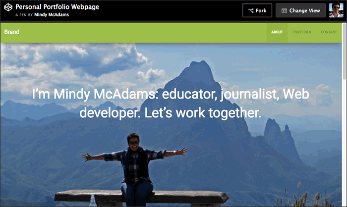
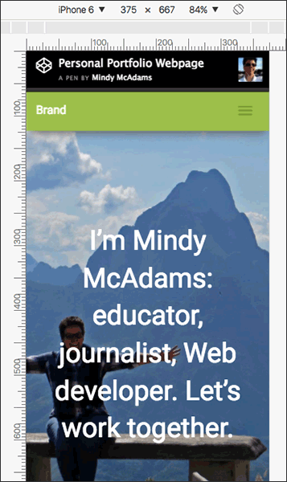

# 100 Days of Code &mdash; Log

<!--
## Day 1: 1 Jan 2017
**Today’s progress:**
**Thoughts:**
**Learned today:**
**Links to work:**
-->

## Day 17: 25 Jan 2017

**Today’s progress:** Still working on the FCC Wikipedia viewer project. Used jQuery to write titles of found Wikipedia pages as H2’s to the HTML page, and the H2’s are links to the correct Wikipedia page, using `?curid=` in the URL. All that’s left is to figure out how to modify the API query so I can get the summary from Wikipedia, then add it as a paragraph below each H2.

**Thoughts:** I’m so happy when I use jQuery and CSS.

**Links to work:** [Working version at Codepen](http://codepen.io/macloo/full/MJjYLP/)

## Missed day: 24 Jan 2017

## Day 16: 23 Jan 2017

**Today’s progress:** Got the Ajax code to work with `action=opensearch` for the Wikipedia API. However, the search results were poor. (Search for `bowie` did not return `David Bowie`.) So, back to the API documentation. Tried `&action=query` with `&generator=search` and got better results (`David Bowie` first in list when I typed just `bowie`.) Had to add `format=json` to the query URL to get rid of an error. Now I have an object with page IDs and titles, and I can log both of those to the console.

**Thoughts:** APIs still annoy me a lot. The documentation is completely obscure. I had to read [this page](https://www.mediawiki.org/wiki/API:Query) for about an hour (including trying many different things that did not work). I had errors with MIME TYPE and User Agents and read a lot of Stack Overflow. I've got a page ID and a title. I can make a URL with the page ID. All I need now is the first paragraph or page summary.

**Links to work:** [Working version so far at Codepen](http://codepen.io/macloo/full/MJjYLP/)

## Missed days: 19–22 Jan 2017

## Day 15: 18 Jan 2017

**Today’s progress:** Spent time with [this tutorial](http://www.9bitstudios.com/2014/03/getting-data-from-the-wikipedia-api-using-jquery/) and [this API page](https://en.wikipedia.org/w/api.php) and figured out the search URL. Ajax not completed, but any search will work now. Need to test for punctuation marks and see if they mess it up.

**Links to work:** [My JavaScript so far](projects/wikipedia-viewer/scripts/search-wikipedia.js)

## Missed day: 17 Jan 2017

## Day 14: 16 Jan 2017

**Today’s progress:** Did not have much time (slightly more than one hour), so I cleaned up the interface for the Wikipedia Viewer project, made the search form write an alert popup and clear itself, and read some more about the MediaWiki API.

**Thoughts:** The frustrating thing about APIs is the documentation, not necessarily the API itself.

**Links to work:** Wikipedia Viewer — [view on Codepen](http://codepen.io/macloo/pen/MJjYLP)

## Missed day: 15 Jan 2017

## Day 13: 14 Jan 2017

**Today’s progress:** I'm quitting the FCC local weather project, and here's why:

* `geolocation.getCurrentPosition` requires `https` in Chrome and Safari.
* The [OpenWeatherMap](http://openweathermap.org/current) API works with `http` and not with `https`. Because of cross-origin restrictions, I can't open the page with `https` and then request an insecure (`http`) URL.
* I examined three other weather data APIs. While some do allow free access to their data via an API, there are other restrictions. For example, Dark Sky uses `https` but won't allow the API key to work if it's exposed, thus requiring backend non-JavaScript handling of the access key.

Started the FCC [Wikipedia Viewer](https://www.freecodecamp.com/challenges/build-a-wikipedia-viewer) project. Read about the API. Reviewed an old project of mine that used the YouTube API to search and show videos in a popup.

**Thoughts:** I'd like to adapt the code from my YouTube search project to this Wikipedia search project. It's probably not responsive, so I'll need to make adjustments. Plus, I'll get to compare the two APIs.

**Links to work:** [View on Codepen](http://codepen.io/macloo/pen/MJjYLP)

## Day 12: 13 Jan 2017

**Today’s progress:** FINALLY. I got a JavaScript promise to work, so that I got my location via the browser with `geolocation.getCurrentPosition` and then passed the latitude and longitude to `google.maps.Geocoder` to get a complete location name. This is the code that works for just that: [weather_bak.js](projects/local-weather-page/scripts/weather_bak.js).

**Thoughts:** No documentation for promises makes sense to me. I just had to try a bunch of examples in jsFiddle and fuss with them until they worked for me. It took hours. And then ...

**Learned today:** It turns out this FCC project is just the **WORST PROJECT EVER,** because after all that misery, it turns out I can't use `google.maps.Geocoder` and [OpenWeatherMap](http://openweathermap.org/current) on the same page, because Google requires `https` and OWM will only work with `http`.

**Links to work:**  [weather_bak.js](projects/local-weather-page/scripts/weather_bak.js) and [this fiddle](https://jsfiddle.net/macloo/c3pqh63u/) ... version with weather API (which will not work): [weather.js](projects/local-weather-page/scripts/weather.js)

## Day 11: 12 Jan 2017

**Today’s progress:** More disappointment. More frustration with promises not working. I thought I finally had it, but I can't get it to run. I even [got a fiddle working](https://jsfiddle.net/macloo/zdem3923/). Time spent: 1.5 hours.

**Links to work:** [At Codepen](https://codepen.io/macloo/pen/oBjxJV)

## Day 10: 11 Jan 2017

**Today’s progress:** Sucks. Still trying to figure out promises. Switched to callbacks for a while. In fact, I spent about an hour on callbacks. Now returning to promises. Total time wasted today: 1.5 hours.

**Learned today:** This seems like a good resource: [JavaScript Promises: an Introduction](https://developers.google.com/web/fundamentals/getting-started/primers/promises).

> “The above and JavaScript promises share a common, standardised behaviour called Promises/A+. If you're a jQuery user, they have something similar called Deferreds. However, Deferreds aren't Promise/A+ compliant, which makes them subtly different and less useful, so beware. jQuery also has a Promise type, but this is just a subset of Deferred and has the same issues.” (From the link above.)

**Links to work:** Same as yesterday. [Weather Where You Are](https://codepen.io/macloo/full/oBjxJV/)

## Day 9: 10 Jan 2017

**Today’s progress:** Read a lot about callbacks and promises. Still not really clear on how to use them correctly. Tested the [OpenWeatherMap API](http://openweathermap.org/current) for getting the current temperature with fixed latlong. That works. Found out that OpenWeatherMap delivers temperature in Kelvin by default. Looked up formulas to convert temps.

**Thoughts:** I understand how callbacks and promises *work* but not how to successfully *use* them. Promises are the new thing and people on Stack Overflow say use them instead of callbacks. Also, it seems SO people like pure JS and not jQuery for promises.

**Links to work:** Same as yesterday. [Weather Where You Are](https://codepen.io/macloo/full/oBjxJV/)

## Day 8: 9 Jan 2017

**Today’s progress:** Started the FCC [Local Weather project](https://www.freecodecamp.com/challenges/show-the-local-weather). No problem with `geolocation.getCurrentPosition()`, but then I tried to use the Google Maps API to do a reverse lookup to get the place name from the latlong, and I can't get it to work. Very frustrating. I got API keys for both [OpenWeatherMap](http://openweathermap.org/appid) and [Google Maps](https://developers.google.com/maps/documentation/geocoding/get-api-key).

**Thoughts:** Maybe I can't use the Google Maps API without a map?

**Learned today:** Are APIs always a pain in the neck? Also, the way my code is now, the latlong from `geolocation.getCurrentPosition()` loads *after* the attempt to get JSON from Google Maps, so I have to figure that out later.

**Links to work:** [Weather Where You Are](https://codepen.io/macloo/full/oBjxJV/)

## Day 7: 8 Jan 2017

**Today’s progress:** Finished the FCC “Random Quote Machine” project. I'm really glad to leave that one behind!

**Thoughts:** The JSON and the API were not much of a problem, but I spent way too much time trying to find a decent free quotation site with an open API. I did find one (maybe), but I'm still waiting for them to send me an authentication code. In the meantime, I fudged it using a site where I can get about six quotes out of their API without paying.

**Learned today:** jQuery: "The `data-` attributes are pulled in the first time the data property is accessed and then are no longer accessed or mutated (all data values are then stored internally in jQuery)." [source](https://api.jquery.com/data/) In other words, *you can't rewrite the value of a `data-` attribute* after the page has loaded — for example, after you have loaded a new quotation. This made it impossible to use the Twitter sharing button I already know about. Tons of time spent Googling, etc. Finally realized I had to use the [Tweet Web Intent](https://dev.twitter.com/web/tweet-button/web-intent) URL in my JavaScript and **not** use Twitter's own button. So I built my own button, which at least matches my **New Quote** button. Used a cool button-builder (see [Resources](resources.md)). I did steal `encodeURIComponent()` from the FCC example for this project. [Here's what it does.](https://developer.mozilla.org/en-US/docs/Web/JavaScript/Reference/Global_Objects/encodeURIComponent)

**Links to work:** [Random Quote Generator](http://codepen.io/macloo/full/bgVdmw/), a Free Code Camp project.

## Day 6: 7 Jan 2017

**Today’s progress:** I just about have the JSON working for the quotes API. I spent an hour and a half, and that's all I want to spend today, but I'm close!

**Thoughts:** The FCC lesson on “Convert JSON Data to HTML” did not solve for the JSON I'm getting from the quotes API I am using. I had to go back and look at some JSON-file-handling notes I made in the past, plus some Stack Overflow searching! I don't need a for-loop because I know the keys in the quotes object.

**Learned today:** You can use `forEach` only on arrays, not on objects.

**Links to work:** [Random Quote Generator](http://codepen.io/macloo/full/bgVdmw/), a Free Code Camp project.

## Missed day: 6 Jan 2017

## Day 5: 5 Jan 2017

**Today’s progress:** Started the [FCC “Random Quote Machine” project](https://www.freecodecamp.com/challenges/build-a-random-quote-machine). It's been so long since I did the exercises in the “JSON APIs and Ajax” section of FCC, I had to go back and look at what I did. They show you just what you need for this project. Worked on this project for about an hour and a half.

**Thoughts:** I was feeling tired of Bootstrap, so for this project I went with vanilla HTML5 and CSS. I would like to create my own JSON file of selected quotes, but it seems like that might be a poor use of time, as it is not coding per se. Maybe later.

**Learned today:** Can use [Twitter code](https://publish.twitter.com/#) for the tweet button. Found an API for an existing quotations site and will use that when I get to the Ajax part (tomorrow, I hope). How to [use Google Fonts on Codepen](https://codepen.io/team/sparkbox/full/OMdwoJ).

**Links to work:** [Random Quote Generator](http://codepen.io/macloo/full/bgVdmw/), a Free Code Camp project.

## Day 4: 4 Jan 2017

**Today’s progress:** Finished the FCC “Build a Personal Portfolio Webpage” project! I decided to use Bootstrap's column styles to create a flexible grid for thumbnails that link to my work. I used [this file](https://github.com/macloo/learning-bootstrap/blob/master/grid_example_enhanced.html) that I made last year when learning Bootstrap for the first time and modified the grid code to work with 400-pixel-wide site thumbnails with captions.

**Thoughts:** The trick to this grid is putting all the images in one row, even though they take up more than 12 columns, and using the weird Bootstrap style `class="clearfix visible-xs-block"` to make it fully responsive. (This is likely to be different in Bootstrap 4.)

**Learned today:** I can store images free at [Postimage](https://postimg.org/). Put my thumbnails there.

**Links to work:** “Build a Personal Portfolio Webpage” at Codepen.io: [A Free Code Camp project](http://codepen.io/macloo/full/rjBKLo/) with Bootstrap.

## Day 3: 3 Jan 2017

**Today’s progress:** Finished the responsive large image code (both CSS and JavaScript) for the top section of the portfolio. I might tweak the text behavior a bit more later on, but for now it's working well.

**Thoughts:** It's so time-consuming to adjust a big background image to be responsive. There's probably a library or plugin for this that I don't know about.

**Learned today:** How to combine `background-size: cover;` and `background-position: center;` and write JavaScript to change the way the background behaves on a phone screen. `$(window).height()` is handy.

**Links to work:** “Build a Personal Portfolio Webpage” at Codepen.io: [A Free Code Camp project](http://codepen.io/macloo/full/rjBKLo/) with Bootstrap.

## Day 2: 2 Jan 2017

**Today’s progress:** Built and implemented a working PHP sendmail page for the contact form in my “Build a Personal Portfolio Webpage” project (see [Resources](resources.md) for link). Tested. Works. Note that my contact form is pretty much copied from [here](https://bootswatch.com/sandstone/#forms). Also added large responsive background image to About section. Added a panel to the footer.

**Thoughts:** Lots of time spent on getting that background image to behave nicely. Reworked some JavaScript I figured out previously for another project. Not done with the About section yet. Portfolio section still empty.

**Learned today:** `background-size: contain;` and `background-size: cover;` (CSS) for a responsive background image. I thought `contain` would work, but it turned out that `cover` was what I needed.

**Links to work:** “Build a Personal Portfolio Webpage” at Codepen.io: [A Free Code Camp project](http://codepen.io/macloo/full/rjBKLo/) with Bootstrap.

## Day 1: 1 Jan 2017

**Today’s progress:** Forked the [100 Days Of Code repo](https://github.com/Kallaway/100-days-of-code); updated [Log](log.md) and [Rules](rules.md). Also changed the README to link to the [original repo](https://github.com/Kallaway/100-days-of-code). Started the “Build a Personal Portfolio Webpage” project. Made/edited the navbar and DIVs for each section. Coded social icons, using Font Awesome. Added contact form.

**Thoughts:** Beginning “100 Days Of Code” would be quite a challenge if you'd never used GitHub before. (Of course, it's a great chance to learn to use GitHub!) At [Free Code Camp](https://www.freecodecamp.com/macloo), I’ve completed the Front End Development Certification lessons through “JSON APIs and Ajax” with one exception: “Build a Personal Portfolio Webpage.” Next up: “Intermediate Front End Development Projects."

**Learned today:** How to add jQuery and other files to a Codepen.io project. How to use alert colors as background colors in Bootstrap. How to install Font Awesome via CDN ([see how](http://fontawesome.io/get-started/)), and how to code the icons (yay!).

**Links to work:** “Build a Tribute Page”: [Georgia O’Keeffe, Artist](http://codepen.io/macloo/full/mORjyd/), in which I practiced using Bootstrap. This is a Free Code Camp project I finished earlier. Today I started “Build a Personal Portfolio Webpage”: [Another Free Code Camp project](http://codepen.io/macloo/full/rjBKLo/) with more Bootstrap. I exported today’s code [as a gist](https://gist.github.com/macloo/4448f77d928a7e3283910de0aab9f845).
